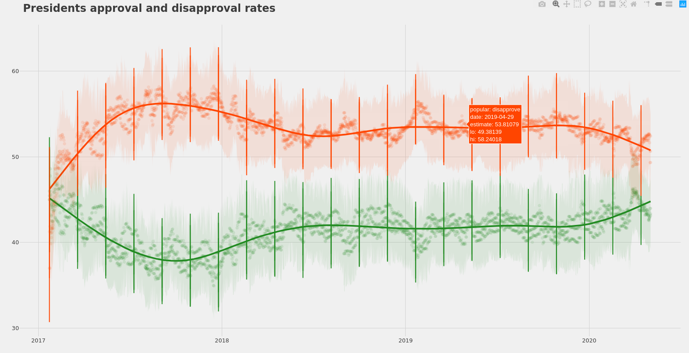

# PresidentApprovalRate

This is a data visualization project, in which I recreate the trend lines in FiveThirtyEight's "How Popular Is Donald Trump?" project using R.

The original project can be viewed here: https://projects.fivethirtyeight.com/trump-approval-ratings/

## Prerequisites

You will need to have R and RStudio installed on your machine. Also, you'll need to install the following packages:
- plotly
- tidyverse
- ggthemes

More details about the role of each will be illustrated below.

## Running Steps

Running this code is very simple, all you need to do is fork the repo, and run the main.R file. The output should look like this:

